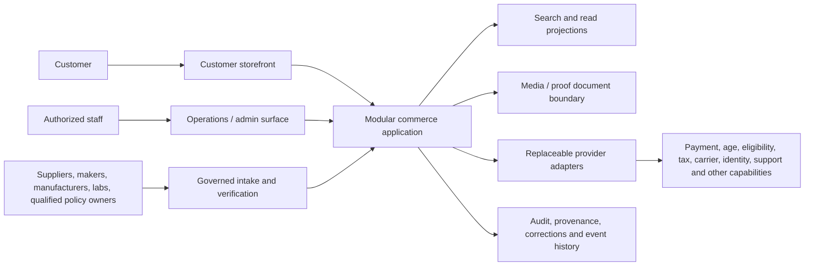

# System Context and Topology

## A. Logical system context

The customer storefront consumes read projections and invokes canonical decisions; it never owns product, price, inventory, proof, relationship, eligibility or policy truth. The operations/admin surface is the governed write entrance for catalog intake, receiving, verification, corrections and service operations. Its permissions follow domain authority, not a universal administrator role.

The modular commerce application contains explicit bounded modules for catalog, variants, price, owned inventory, media, proof, compatibility, fit, qualification, eligibility, cart, order, fulfillment, identity/consent, support, policy and audit. THCA, Vape & Nicotine, and Glass & Accessories share this house topology while retaining distinct product facts and decision relationships.

External authoritative sources enter through recorded intake and verification. External providers enter through adapters. Neither a source nor provider may directly rewrite another domain's canonical records.

## B. Simplest viable topology

| Option | Strength | Risk | Decision |
|---|---|---|---|
| Modular monolith with explicit modules, transactional outbox, read projections and provider adapters | Keeps cross-domain cart/order consistency tractable; minimizes operational overhead before traffic, staffing and providers are known; permits later extraction | Requires disciplined module ownership and prevents shared-table shortcuts | **PROVISIONALLY SELECTED** |
| Premature distributed services | Independent deployment and scaling could help at proven boundaries | Adds network failure, distributed transactions, observability burden, duplicate truth and team overhead without evidence | Rejected for Phase 1 |

The provisional topology is a **modular monolith with explicit bounded modules**, a canonical transactional core, transactional outbox, asynchronous projection consumers and replaceable provider adapters. No language, framework, cloud, database or commerce platform is selected.

Logical isolation is still mandatory:

- payment credentials and sensitive payment data stay behind the payment adapter; canonical commerce retains references and outcomes, not provider secrets or prohibited payment data;
- age-verification evidence is minimized behind the age adapter; the qualification domain stores only the approved result/reference and necessary audit metadata;
- proof and media binaries use a controlled document boundary while metadata and applicability remain canonical;
- identity, consent and private support data remain access-controlled and separate from public catalog projections;
- every external provider has explicit timeout, retry, idempotency, audit and portability behavior.

## C. Paths and consistency

### Write paths

1. An authenticated actor or trusted adapter submits a command to the owning domain.
2. The domain validates identity, authority, current version, provenance and required invariants.
3. The domain commits the canonical record, immutable audit context and outbox event in one transaction where they share a consistency boundary.
4. Downstream projections and modules consume the event idempotently.
5. Cross-domain commands never mutate another domain's canonical tables directly.

Examples: receiving writes Inventory; a supplier record can inform Catalog intake but cannot self-approve a product; Payment writes no Order state directly and returns an outcome to the Order orchestration boundary; Eligibility evaluates versioned rules but does not alter Inventory.

### Read projections

Storefront, search, division/category, PDP, cart summaries, account, support and operations dashboards use purpose-specific projections. A projection carries source version, projection time and material staleness/error state. It is rebuildable from canonical records/events and cannot be corrected independently. Decision paths re-read or revalidate canonical/current state when stale projections could permit an invalid action.

### Synchronous decision paths

The following are synchronous at a progression checkpoint: selected variant resolution, current price, owned inventory availability/reservation, age result, destination/product eligibility, material compatibility/fit, required components, material proof and fulfillment-method readiness. Timeouts produce a service-error or unknown result according to the exact domain; they never produce success.

### Asynchronous event paths

Search/index updates, media invalidation, proof-staleness notices, notification eligibility, support context enrichment, analytics, audit exports and non-blocking operational alerts consume outbox events asynchronously. Their lag must be observable. A stale projection cannot authorize purchase when the canonical gate changed.

### Transactional consistency boundaries

- Canonical record plus version/audit/outbox event.
- Inventory reservation plus inventory-position decrement/hold.
- Order submission plus immutable order-line snapshots and idempotency record.
- A single payment command attempt plus its provider reference/outcome record; payment and order use explicit orchestration, not a distributed transaction.
- Fulfillment selection plus allocation request, followed by explicit success/failure compensation.

### Eventual-consistency boundaries

- search and merchandising projections;
- media delivery caches;
- support and analytics projections;
- non-blocking notifications;
- proof/relationship discovery views, provided purchase checkpoints revalidate their canonical versions;
- external carrier/status updates after order acceptance.

## Correction propagation and invalidation

An authorized correction creates a new version or invalidation; history is retained. `Correction Published` names affected record/version, reason category, authority, effective time and dependent capabilities. Consumers idempotently invalidate search, PDP/card, cart, proof, relationship, policy and support projections. Active carts and not-yet-final orders are revalidated. Historical orders retain labeled snapshots while current reorder paths use current truth.

Cache keys and index documents include canonical version/effective context where material. Invalidation failure is observable and retried; a known stale decision-critical value is suppressed or labeled and cannot silently authorize progression.

## Failure containment

- Adapter outage is contained behind its domain and reported as service error, never converted to ineligible, unavailable, incompatible or paid.
- Search failure does not mutate catalog and provides bounded browse/support recovery.
- Media failure preserves textual identity and decision facts.
- Proof-store failure preserves applicability status but blocks/suppresses claims when access is material.
- Payment uncertainty prevents duplicate submission and routes to outcome reconciliation.
- Inventory conflict preserves the cart line and returns a localized unavailability/change state.
- Event-consumer failure does not roll back an already committed canonical write; retries are idempotent and dead-letter handling is audited.

## Audit and observability

Every canonical write records actor/service, authority, command/idempotency key, source/provenance, prior/new version, effective/observed time, reason and correlation identifiers. Sensitive values are minimized or redacted. Logs never become the only audit record.

Metrics, traces and structured logs must expose adapter latency/failure, event lag, projection version, inventory reservation conflicts, cart blocker distribution, payment uncertainty, eligibility service failure, correction propagation, stale proof, invalid relationship use and support-handoff failure. Quantitative SLOs remain **OPEN** until providers, traffic, staffing and operating data exist.
